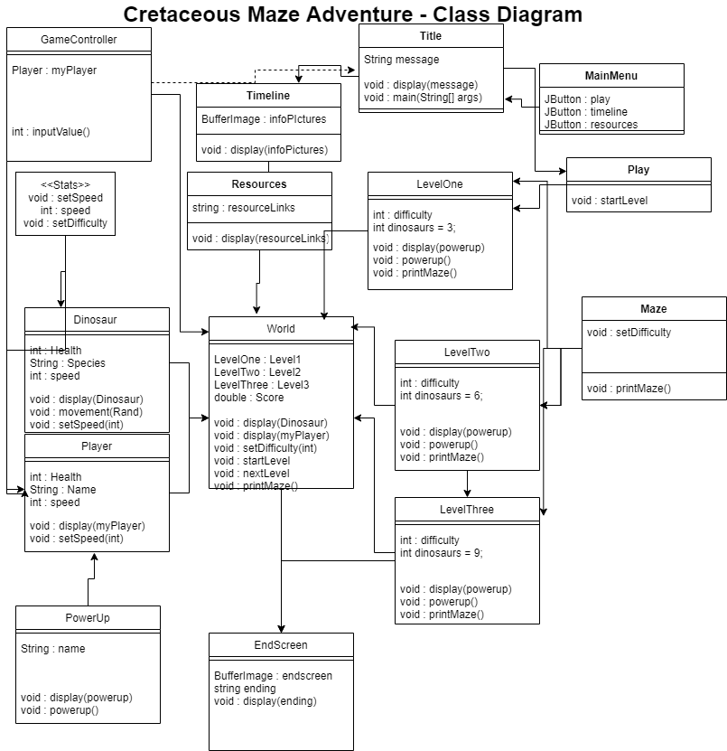

# Cretaceous Maze Adventure
This is a repository for group projects for group 3 in Mr. Kapptie's programming 2 class. Our project is called Cretaeous Maze Adventure. The goal of the game is to get through a maze with enemy dinosaurs, and after you beat the level with those dinosaurs, a frame will pop up and tell you information about that dinosaur. On the start screen, there will also be options to play the game, see the timeline of the dinosaurs, and look at more resources for learning about them. Our group members are Aaron Wang, Aiden DeBoer, Jonathan Widmer, and William Bastian. Aaron is in charge of class connectivity, Aiden is in charge of buttons and information, Jonathan is in charge of movement and enemy controls, William is in charge of graphics.

# GUI Mockups
### Title Screen

### Main Menu

### Timeline

### Resources

### Maze

## DOCUMENTATION:
1. video or images of project running

Blue circle represents user. User guides blue circle against the red enemies(dinosaurs) to make it past the level.
If the user beats the level, they learn about the dinosaurs they defeated. At the title screen, the user can select to play the game, look at the timeline, or use resources to learn more about the dinosaurs. As the levels are beaten, the user will learn about dinosaurs after beating the level that dinosaur was part of. (Not what the final game will look like.)
