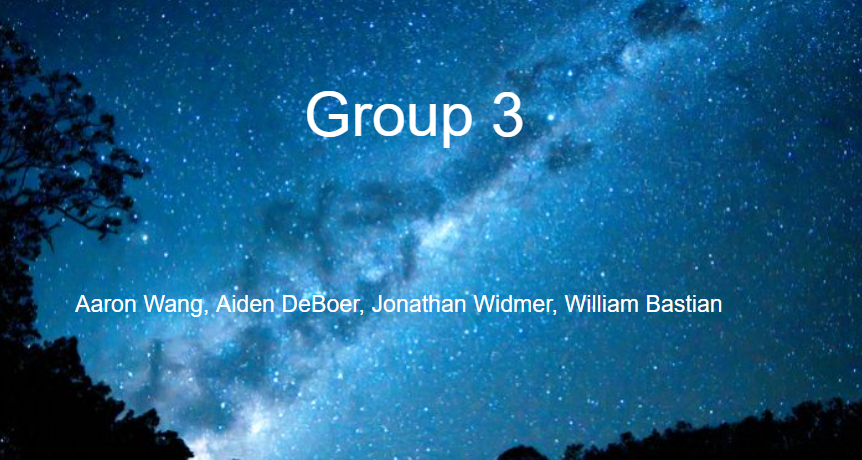
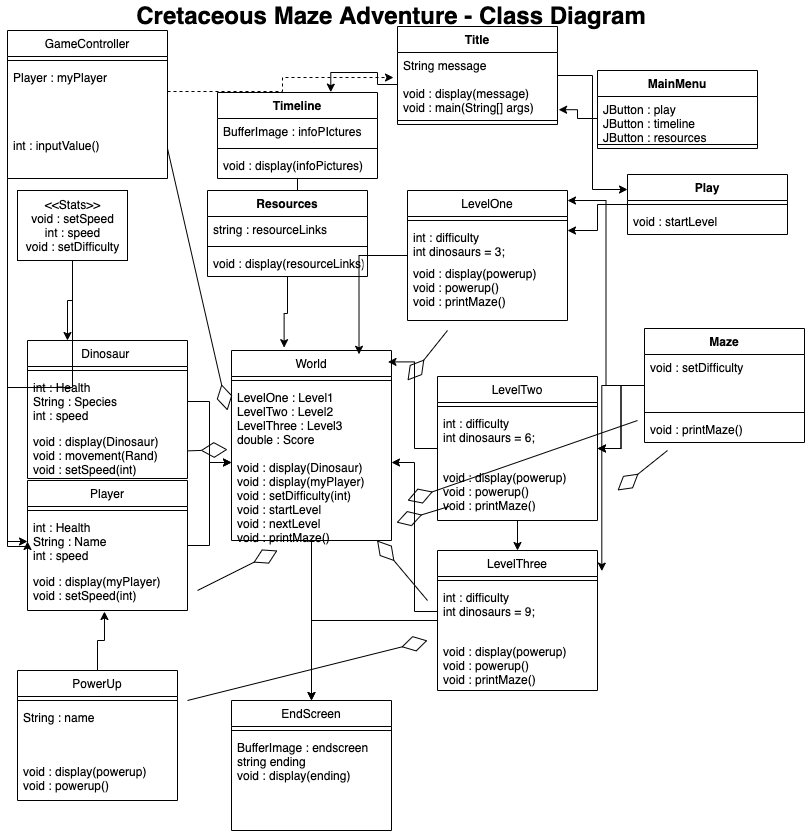
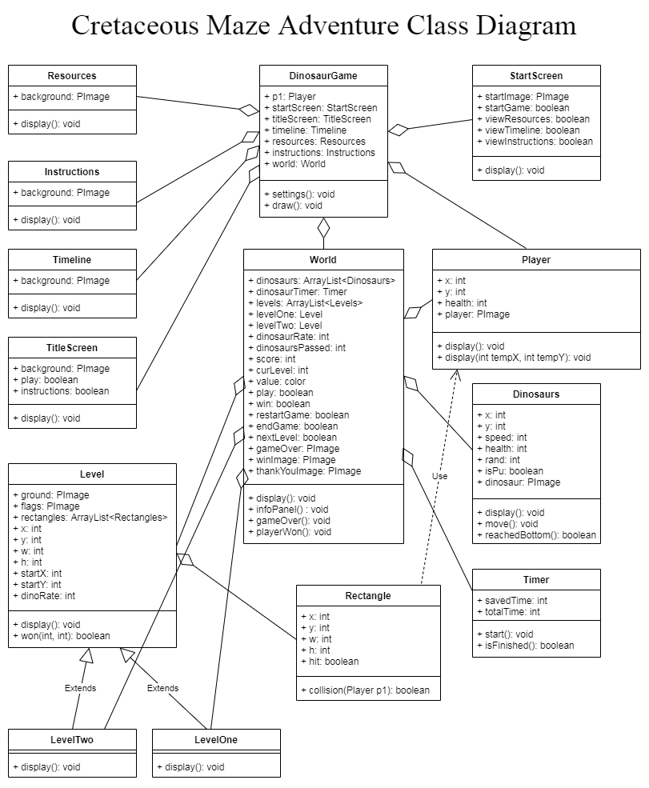
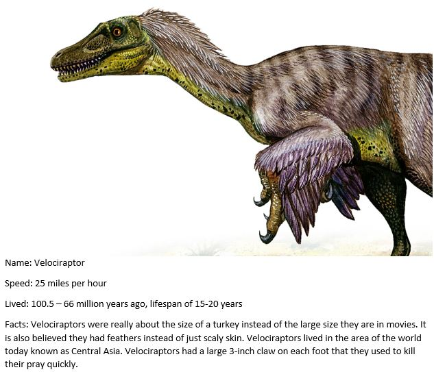
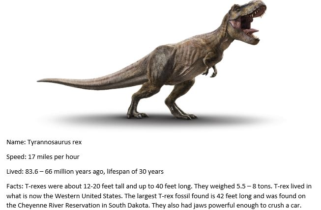
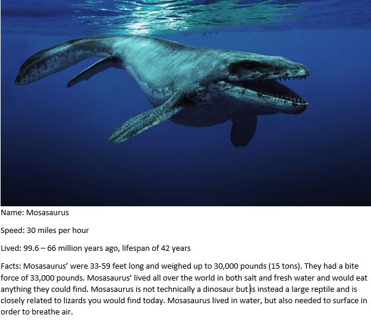
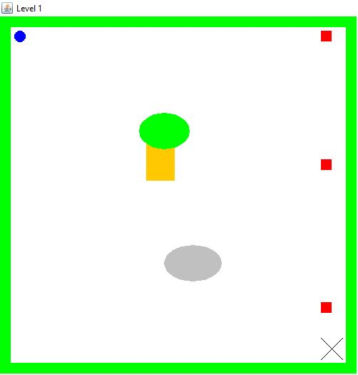

# Cretaceous Maze Adventure
This is a repository for group projects for group 3 in Mr. Kapptie's programming 2 class. Our project is called Cretaeous Maze Adventure. The goal of the game is to get through a maze with enemy dinosaurs, and after you beat the level with those dinosaurs, you can play again or go to the next level. On the start screen, there will also be options to play the game, see the timeline of the dinosaurs, and look at more resources for learning about them. Our group members are Aaron Wang, Aiden DeBoer, Jonathan Widmer, and William Bastian. Aaron was in charge of class connectivity, Jonathan was in charge of GUI controls and both Aiden and William did graphics. 

The year 2 concepts in our project are:
- ternary statements
- file I/O
- GUI controls
- collections (ArrayLists)
- inheritance

## Executable Jar File
[Executable Jar File](https://github.com/jonathanwidmer/programmingroupproject/raw/main/applications/application.windows64.zip) for Windows 64

[Executable Jar File](https://github.com/jonathanwidmer/programmingroupproject/raw/main/applications/application.windows32.zip) for Windows 32

[Mac OS version](https://github.com/jonathanwidmer/programmingroupproject/raw/main/applications/application.macosx-20210521T192826Z-001.zip) for Mac OS

Note: The Mac OS version is not the most recent version. It will be updated on Monday, May 24.

Please download the zip file and extract the files before running the application.

## Class Diagram
First Class Diagram

Final Class Diagram

# Dinosaur Graphics

# GUI Mockups
### Main Menu

### Title Screen

### Timeline

### Resources

### Maze

## DOCUMENTATION:
1. video or images of project running

[Final Project Video](https://github.com/jonathanwidmer/programmingroupproject/raw/main/finalprojectvideo.mp4)

This is not what the final game will look like because we are going to switch to doing it in Processing instead of Java, but this picture explains the concept of the game. The user is represented by blue, and the dinosaurs by red. The user has to go through a maze without being killed by dinosaurs and make it to the end. When they are at the end, they can go to the next level, replay the level, or go back to the title screen and read the instructions, look at the resources, and look at the timeline to learn about the game and the dinosaurs in it.

Level 1 Demonstration

Level 2 Demonstration

